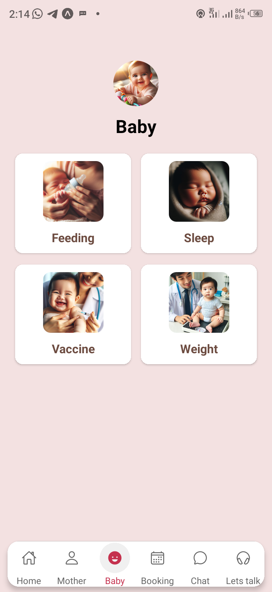
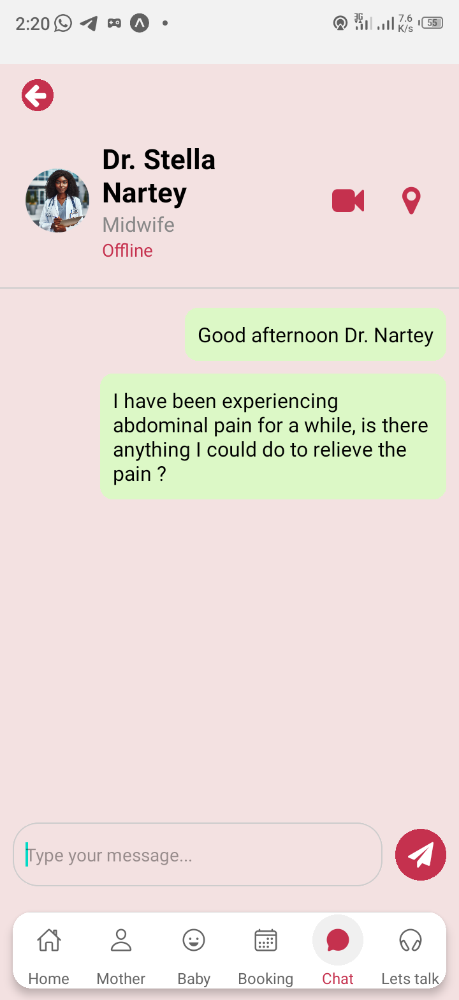

# Skyfit

 

Skyfit is a comprehensive mobile application designed to support expectant mothers throughout their pregnancy journey. The app offers personalized insights for mothers and the unborn baby including tracking the expectant weeks of pregnancy to delivery period, nutrition tip and more ,appointment reminders, daily motivational support quote, GPS tracker for emergencies and an AI-driven chatbot for assistance.

## Table of Contents

- [Features](#features)
- [Tech Stack](#tech-stack)
- [Setup and Installation](#setup-and-installation)
- [Usage](#usage)
- [API Documentation](#api-documentation)
- [Contributing](#contributing)
- [License](#license)
- [Contact](#contact)

## Features

- **Personalized Insights Dashboard**: Receive daily and weekly insights tailored to your pregnancy stage with remaining weeks to cover till delivery.
- **Mother Screen**: This session contains Meals, Exercises Articels for mother to give mothers insight on how to go about their daily maternal periods.
- **Baby Screen**: This session contains the feeding, sleeping times, weight checks and periods for vacination of baby when time is due .
- **Messaging App**: The messaging session enables patients to seamlessly connecct with health professionals reducing the travels specially for those in the rural areas.
- **Appointment Booking Reminders**: Set and receive reminders for upcoming doctor appointments.
- **Motivational Support**: Get daily motivational quotes to stay positive.
- **AI Chatbot**: An intelligent assistant to answer pregnancy-related questions and provide support.

## Tech Stack

### Frontend
- React Native
- Axios

### Backend
- Node.js
- Firebase Firestore

### AI Model
- Google Gemini Pro
- Python


### Deployment
- Expo Go

## Setup and Installation

### Prerequisites
- Node.js
- npm or yarn
- Python (for AI model development)
- Firebase account

### Frontend Setup

1. Clone the repository:
    ```bash
    git clone https://github.com/Juniorkpabitey/skyfit.git
    cd skyfit
    ```

2. Install dependencies:
    ```bash
    npm install
    ```

3. Set up Firebase:
    - Create a Firebase project and configure Firestore.
    - Copy the Firebase config object and paste it into `src/config/firebaseConfig.js`.

4. Start the React Native app with expo:
    ```bash
    npx expo start                 # For Expo Go
    npx react-native run-android   # For Android
    npx react-native run-ios       # For iOS
    ```

### Backend Setup
1. Create a `.env` file and add your Firebase and other environment configurations:
    ```bash
    FIREBASE_API_KEY=your_firebase_api_key
    FIREBASE_AUTH_DOMAIN=your_firebase_auth_domain
    FIREBASE_PROJECT_ID=your_firebase_project_id
    FIREBASE_STORAGE_BUCKET=your_firebase_storage_bucket
    FIREBASE_MESSAGING_SENDER_ID=your_firebase_messaging_sender_id
    FIREBASE_APP_ID=your_firebase_app_id
    ```


#### Front End UI
1. Dashboard
 

2. Mothers Screen


3. Baby's screen


4. Chat's session


5. Ai Assistant

### AI Model Setup

1. Create a Google Gemini AI model to obtain an API KEY for the chatbot modelling
   
## Usage

### Frontend

- Open the Skyfit app on your device.
- Sign up or log in with your credentials.
- Access various features such as personalized insights, messaging, appointment reminders, and the AI chatbot.

### Backend

- The backend server will handle API requests from the frontend and provide data from Firebase Firestore.

### AI Chatbot

- The AI chatbot server will process user queries and provide intelligent responses based on the trained model with Google Gemini Pro Model.


## Contributing

We welcome contributions from the community! Here’s how you can get involved:

1. Fork the repository.
2. Create a new branch (`git checkout -b feature-branch`).
3. Commit your changes (`git commit -m 'Add new feature'`).
4. Push to the branch (`git push origin feature-branch`).
5. Open a pull request.

Please read our [contributing guidelines](CONTRIBUTING.md) for more details.

## License

This project is licensed under the MIT License.

## Contact

If you have any questions or feedback, please contact us at:
- Email: 
    - juniorkpabitey123@gmail.com
    - support@skyfit.com
- GitHub Issues: [https://github.com/Juniorkpabitey/skyfit/issues](https://github.com/Juniorkpabitey/skyfit/issues)
